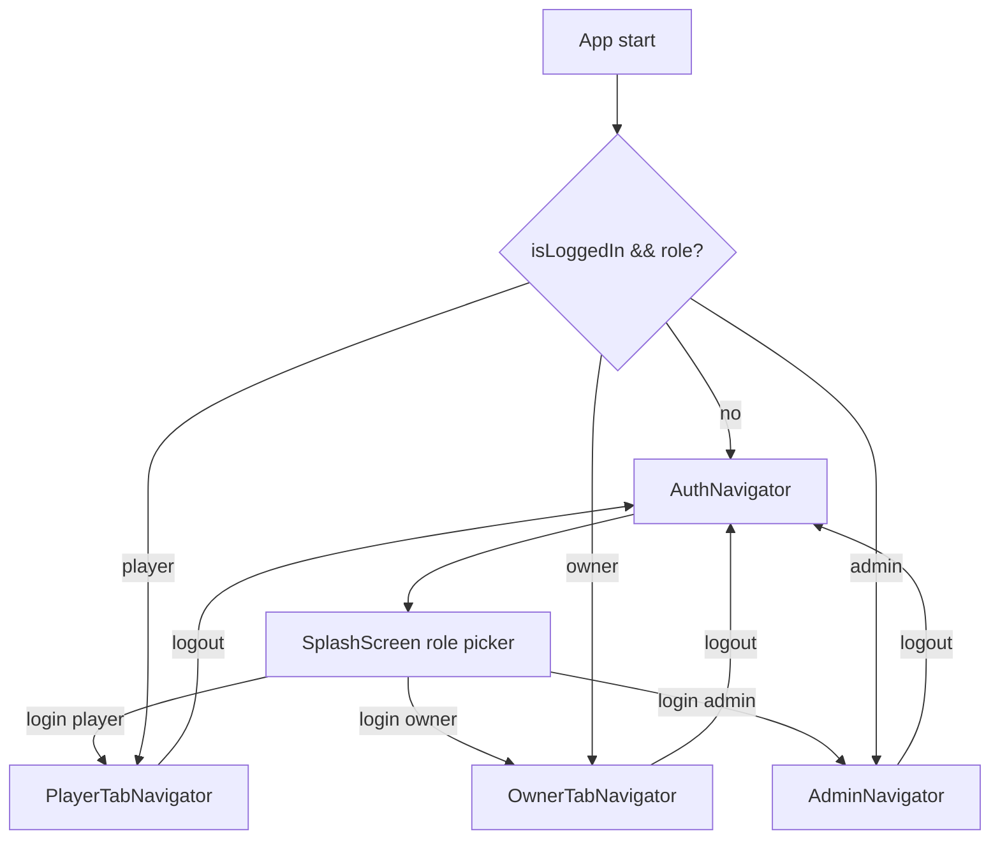
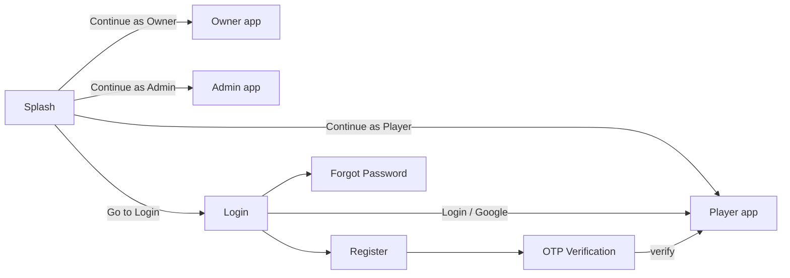
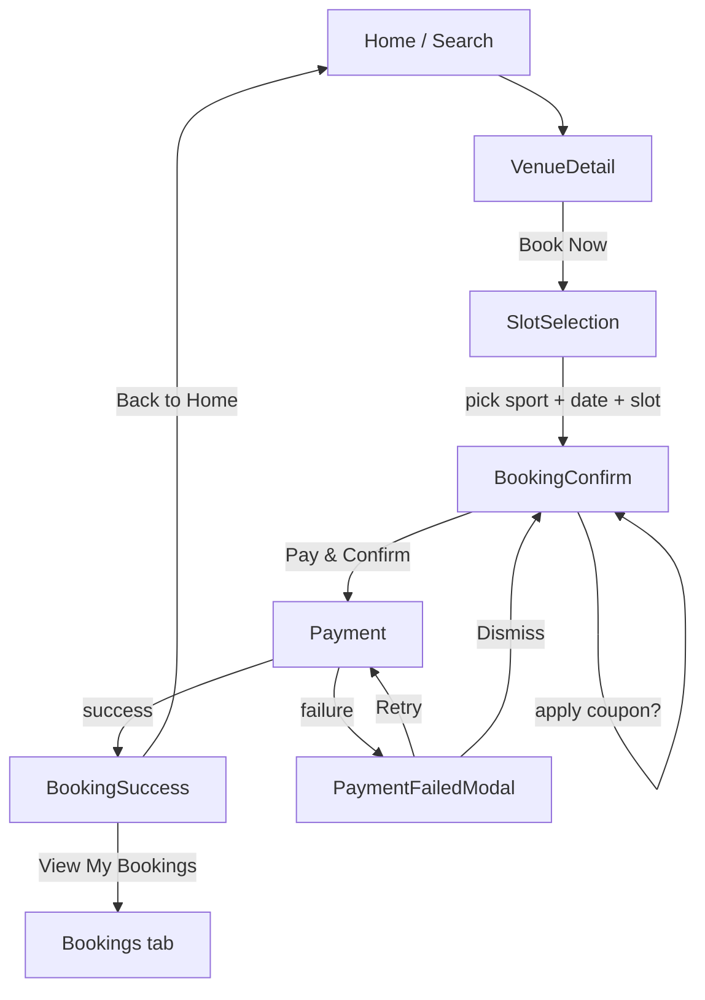
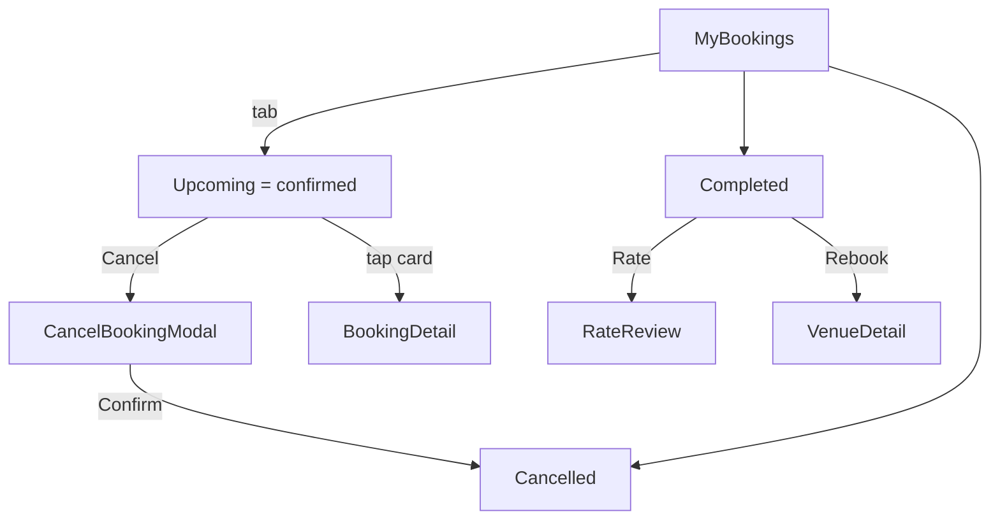
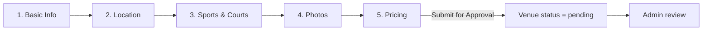
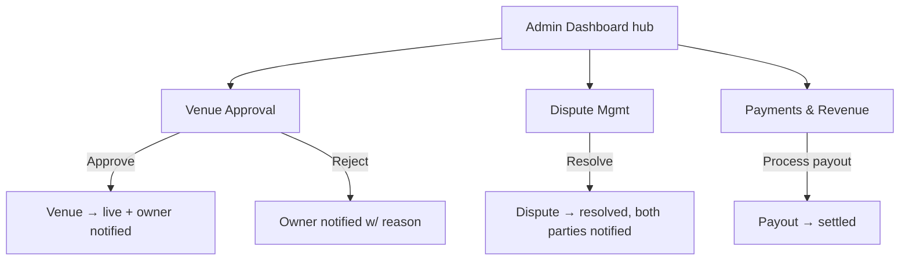
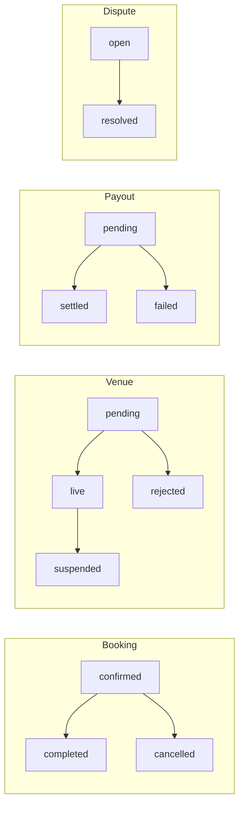

# TurfBook — Project Documentation

> A turf / sports-venue booking marketplace built with **Expo React Native (TypeScript)**.
> Three roles — **Player**, **Venue Owner**, **Admin** — each with fully wired screens,
> routing, and static/mock data. This document describes every screen, operation,
> business condition, and flow in the project.

---

## Table of Contents

1. [Project Overview](#1-project-overview)
2. [Technology Stack](#2-technology-stack)
3. [Running the App](#3-running-the-app)
4. [Folder Structure](#4-folder-structure)
5. [Architecture](#5-architecture)
6. [Data Models](#6-data-models)
7. [Roles & Permissions](#7-roles--permissions)
8. [Screen Catalog](#8-screen-catalog)
9. [Operational Flows](#9-operational-flows)
10. [Business Rules & Conditions](#10-business-rules--conditions)
11. [Components Catalog](#11-components-catalog)
12. [Modals Catalog](#12-modals-catalog)
13. [Notifications](#13-notifications)
14. [Route Reference](#14-route-reference)
15. [Extending to Production](#15-extending-to-production)

---

## 1. Project Overview

TurfBook is a two-sided marketplace (think "Airbnb for sports turfs"). Players discover
and book hourly slots at sports venues; venue owners list and manage their turfs and
get paid; an admin/platform team approves venues, resolves disputes, processes payouts,
and runs promotions.

**Revenue model**

| Source | Value | Where it applies |
|---|---|---|
| Platform commission | **10%** of booking value | Deducted from owner payout |
| Convenience fee | **₹20** flat | Added to player's total at checkout |
| Featured listing / subscription | Upsell | Owner subscription screen |

The current build is a **front-end demo with static data** — no backend, no real
payment gateway. Every flow is fully navigable; data mutations live in component state
so they reset on reload.

---

## 2. Technology Stack

| Layer | Choice |
|---|---|
| Framework | Expo SDK 51 / React Native 0.74 |
| Language | TypeScript |
| Navigation | React Navigation v6 (native-stack + bottom-tabs) |
| State | React Context (`AuthContext`) + local component state |
| Styling | `StyleSheet` + centralized theme tokens |
| Data | Static module (`src/data/mockData.ts`) typed against `src/types` |
| Icons | Emoji (no icon-font dependency) |

---

## 3. Running the App

```bash
unzip turfbook.zip && cd turfbook
npm install
npx expo start         # press a (Android), i (iOS), or scan QR in Expo Go
```

Requires Node 18+. If a native-dependency version warning appears:

```bash
npx expo install react-native-screens react-native-safe-area-context
```

---

## 4. Folder Structure

```
App.tsx                      # Providers + NavigationContainer + RootNavigator
app.json / babel.config.js / tsconfig.json / package.json
src/
  theme/        index.ts      # colors, spacing, radius, typography, shadow tokens
  types/        index.ts      # all shared TypeScript interfaces & status unions
  data/         mockData.ts   # all static data + helpers (getSportName, getSportIcon)
  store/        AuthContext.tsx   # role-based auth context (login / logout)
  components/
    common/     index.tsx     # AppButton, AppInput, AppHeader, StatusBadge, …
    venue/      index.tsx     # VenueCard, SlotGrid, BookingCard, PriceSummary
  modals/       index.tsx     # confirm / cancel / coupon / payment / lock / rating
  screens/
    auth/                     # Splash, Login, Register, OTP, ForgotPassword
    player/                   # Home, Search, VenueDetail, SlotSelection, …(15)
    owner/                    # Dashboard, MyVenues, AddVenue, Calendar, …(13)
    admin/                    # Dashboard, Approvals, Disputes, Payments, …(14)
  navigation/
    RootNavigator.tsx         # role → navigator switch
    AuthNavigator.tsx         # auth stack
    PlayerTabNavigator.tsx    # player tabs + per-tab stacks
    OwnerTabNavigator.tsx     # owner tabs + per-tab stacks
    AdminNavigator.tsx        # admin stack (dashboard hub + modules)
```

---

## 5. Architecture

### 5.1 State Management — `AuthContext`

A single React Context drives the whole app. Its shape:

```ts
interface AuthState {
  user: User | null;
  role: 'player' | 'owner' | 'admin' | null;
  isLoggedIn: boolean;            // true when role !== null
  login: (role: UserRole) => void;  // sets the active role
  logout: () => void;             // clears role → returns to auth
}
```

- `login(role)` sets the current role; `user` is derived from `CURRENT_USERS[role]`.
- `logout()` clears the role; `RootNavigator` then shows the auth flow.
- There is **no password check** — this is a demo role switcher.

### 5.2 Navigation Architecture

`RootNavigator` reads `role` from the context and renders exactly one navigator:

```
role == null   → AuthNavigator          (Splash → Login/Register/OTP/Forgot)
role == player → PlayerTabNavigator     (5 bottom tabs, each its own stack)
role == owner  → OwnerTabNavigator      (5 bottom tabs, each its own stack)
role == admin  → AdminNavigator         (single stack: dashboard hub + modules)
```



**Shared-screen pattern (important).** In the Player and Owner tab navigators, *each
tab is its own native stack*. Screens reachable from more than one tab (venue detail,
the booking flow, notifications, etc.) are registered in **every** tab stack via a
`makeStack(initialScreen, SHARED[])` helper. This guarantees that any
`navigation.navigate('X')` resolves regardless of which tab is currently active.

**Cross-tab jumps.** Tab names (`HomeTab`, `Bookings`, `EarningsTab`, `VenuesTab`, …)
are *not* registered as stack screens. So a call like `navigation.navigate('Bookings')`
from deep inside the Home stack fails to match locally, bubbles up to the tab navigator,
finds the `Bookings` tab, and switches to it. This is exactly how "View My Bookings"
on the success screen works.

### 5.3 Theme Tokens — `src/theme/index.ts`

| Token group | Notable values |
|---|---|
| Role accents | `primary` (player) `#0FAE6E`, `owner` `#2563EB`, `admin` `#7C3AED` |
| Slot states | `slotAvailable`, `slotBooked`, `slotBlocked`, `slotSelected` |
| Status | `success`, `warning`, `danger`, `info`, `star` |
| Neutrals | `bg`, `surface`, `surfaceAlt`, `border`, `text`, `textMid`, `textDim` |
| Scales | `spacing`, `radius`, `fontSize`, `fontWeight`, `shadow` |

### 5.4 Data Layer

All data is exported from `src/data/mockData.ts`, typed against `src/types`. To go live,
replace each constant with an API call (or React Query/SWR) keeping the same shapes —
screens consume the types directly and keep working. Key datasets:

`SPORTS(6)`, `VENUES(4)`, `PENDING_VENUES(1)`, `SLOTS` (keyed by court id),
`BOOKINGS(5)`, `REVIEWS(3)`, `COUPONS(3)`, `PAYOUTS(3)`, `DISPUTES(2)`,
`NOTIFICATIONS(4)`, `CURRENT_USERS`, `ADMIN_KPIS`, `OWNER_STATS`.

---

## 6. Data Models

Status unions (`src/types/index.ts`):

| Type | Allowed values |
|---|---|
| `UserRole` | `player` · `owner` · `admin` |
| `BookingStatus` | `confirmed` · `completed` · `cancelled` |
| `VenueStatus` | `live` · `pending` · `rejected` · `suspended` |
| `SlotStatus` | `available` · `booked` · `blocked` |
| `PaymentStatus` | `success` · `pending` · `failed` · `refunded` |
| `DisputeStatus` | `open` · `resolved` |

Core entities (fields summarized):

- **User** — `id, name, email, phone, role, avatar`
- **Sport** — `id, name, icon`
- **Court** — `id, name, sportId`
- **Venue** — `id, ownerId, name, address, city, description, status, rating, reviewCount, distanceKm, pricePerSlot, photos[], coverPhoto, sports[], amenities[], courts[], lat, lng`
- **Slot** — `id, courtId, date, startTime, endTime, status, price`
- **Booking** — `id, playerId, playerName, venueId, venueName, venuePhoto, sport, courtName, date, startTime, endTime, amount, commission, status, paymentStatus, hasReview?`
- **Review** — `id, venueId, playerName, rating, comment, date, categories`
- **Coupon** — `id, code, discountType, discountValue, minBooking, maxDiscount?, validUntil, usedCount, maxUses, isActive`
- **Payout** — `id, ownerId, ownerName, amount, commissionDeducted, netAmount, status, date`
- **Dispute** — `id, bookingId, playerName, ownerName, venueName, issue, status, date`
- **AppNotification** — `id, title, body, time, type, read`

---

## 7. Roles & Permissions

| Capability | Player | Owner | Admin |
|---|:--:|:--:|:--:|
| Browse & search venues | ✅ | — | view all |
| Book slot & pay | ✅ | — | — |
| Cancel / review / rebook own booking | ✅ | — | — |
| List / edit venues | — | ✅ | — |
| Block slots / manage calendar | — | ✅ | — |
| View earnings & payouts | — | ✅ | platform-wide |
| Approve / reject venues | — | — | ✅ |
| Resolve disputes | — | — | ✅ |
| Process owner payouts | — | — | ✅ |
| Create coupons / broadcast | — | — | ✅ |
| Platform settings (commission, fee) | — | — | ✅ |

The active role is chosen on the Splash screen and can be changed by logging out.

---

## 8. Screen Catalog

### 8.1 Auth (`src/screens/auth`)

| Screen | Route | Purpose | Leads to |
|---|---|---|---|
| SplashScreen | `Splash` | Demo role picker + entry to login | `login(role)` or `Login` |
| LoginScreen | `Login` | Email/password (prefilled), Google button | `login('player')`, `Register`, `ForgotPassword` |
| RegisterScreen | `Register` | Sign up with player/owner toggle | `OTPVerification` |
| OTPVerificationScreen | `OTPVerification` | 6-digit code entry | `login('player')` |
| ForgotPasswordScreen | `ForgotPassword` | Request reset link | back to `Login` |

### 8.2 Player (`src/screens/player`)

| Screen | Route | Purpose |
|---|---|---|
| PlayerHomeScreen | `Home` (HomeTab) | Greeting, search bar, banner, sport filter, nearby venues |
| SearchScreen | `SearchHome` / `Search` | Query + sport filter, result list |
| VenueDetailScreen | `VenueDetail` | Cover, sports, amenities, about, reviews, sticky **Book Now** |
| SlotSelectionScreen | `SlotSelection` | Sport tabs, date strip, slot grid, **Proceed to Book** |
| BookingConfirmScreen | `BookingConfirm` | Summary, coupon, payment method, price breakdown |
| PaymentScreen | `Payment` | Simulate gateway success/failure |
| BookingSuccessScreen | `BookingSuccess` | QR/booking id, View Bookings / Back to Home |
| MyBookingsScreen | `BookingsHome` (Bookings tab) | Upcoming / Completed / Cancelled tabs |
| BookingDetailScreen | `BookingDetail` | QR, receipt, cancel/invoice actions |
| RateReviewScreen | `RateReview` | Overall + 3 category star ratings + comment |
| PlayerProfileScreen | `ProfileHome` (Profile tab) | Avatar, stats, menu, logout |
| NotificationsScreen | `Notifications` | Notification list |
| Offers / Wallet / HelpSupport / Settings / EditProfile / Reschedule / Dispute | resp. | Misc account screens |

### 8.3 Owner (`src/screens/owner`)

| Screen | Route | Purpose |
|---|---|---|
| OwnerDashboardScreen | `DashboardHome` (DashboardTab) | Today's KPIs, quick actions |
| MyVenuesScreen | `VenuesHome` (VenuesTab) | List of owner venues, add/edit/calendar |
| AddVenueScreen | `AddVenue` | 5-step venue creation wizard |
| EditVenueScreen | `EditVenue` | Edit name/description/price |
| VenueCalendarScreen | `VenueCalendar` | Slot grid (owner mode) + block / bulk-block |
| BookingManagementScreen | `OwnerBookingsHome` (OwnerBookings tab) | Incoming bookings list |
| OwnerBookingDetailScreen | `OwnerBookingDetail` | Single booking detail |
| EarningsScreen | `EarningsHome` (EarningsTab) | Revenue + payout history |
| ReviewsManagementScreen | `ReviewsManagement` | Reviews on owner venues |
| OwnerProfileScreen | `OwnerProfileHome` (OwnerProfileTab) | Profile + menu + logout |
| SubscriptionScreen | `Subscription` | Featured-listing / plan upsell |
| OwnerNotificationsScreen | `OwnerNotifications` | Owner notifications |
| OwnerSettingsScreen | `OwnerSettings` | Owner settings |

### 8.4 Admin (`src/screens/admin`)

| Screen | Route | Purpose |
|---|---|---|
| AdminDashboardScreen | `AdminDashboard` | KPIs, alerts, module grid (hub) |
| VenueApprovalScreen | `VenueApproval` | Approve / reject pending venues |
| VenueManagementScreen | `VenueManagement` | All venues + status |
| PlayerManagementScreen | `PlayerManagement` | Players list, block/unblock |
| OwnerManagementScreen | `OwnerManagement` | Owners + KYC status |
| AdminBookingsScreen | `AdminBookings` | All bookings |
| PaymentsRevenueScreen | `PaymentsRevenue` | Revenue + process owner payouts |
| DisputeManagementScreen | `DisputeManagement` | Resolve disputes |
| CouponManagementScreen | `CouponManagement` | Create / list coupons |
| NotificationBroadcastScreen | `NotificationBroadcast` | Push to all/players/owners |
| AnalyticsScreen | `Analytics` | GMV, take-rate, weekly bookings chart |
| CategoryManagementScreen | `CategoryManagement` | Manage sport categories |
| CMSScreen | `CMS` | Static content pages |
| AdminSettingsScreen | `AdminSettings` | Commission, fee, maintenance, logout |

---

## 9. Operational Flows

### 9.1 Authentication



- The Splash buttons call `login(role)` directly (fast demo switch).
- Login and OTP both enter the **Player** app (`login('player')`).
- Register lets the user pick **player** or **owner** before OTP.

### 9.2 Player — Discovery → Booking → Payment



**Step conditions**

1. **SlotSelection** — sport tabs come from `venue.sports`; the visible court is the
   first court matching the active sport. Slots come from `SLOTS[court.id]`. Only
   `available` slots are selectable; `booked` and `blocked` are disabled. A
   `SlotLockExpiredModal` is wired for the (demo) slot-lock timeout case.
2. **BookingConfirm** — computes:
   `discount` (TURF20 → 20% of slot price, FIRST100 → ₹100, else 0),
   `total = slotPrice + ₹20 convenience fee − discount`.
   Payment method defaults to **UPI** (alternatives: Card, Wallet).
3. **Payment** — simulates the gateway with a 1.5s spinner, then:
   - *Success* → `navigation.replace('BookingSuccess')` (replace, so back doesn't
     return to the payment screen).
   - *Failure* → `PaymentFailedModal` with **Retry** (re-opens payment) or **Dismiss**
     (returns to confirm).

### 9.3 Player — Post-booking (Manage / Cancel / Review)



- **Tabs filter by status:** Upcoming = `confirmed`, Completed = `completed`,
  Cancelled = `cancelled`. The list is scoped to the current player (`playerId === 'p1'`).
- **Cancel** opens a modal showing a **refund amount** (demo: 50% of `amount`) and the
  cancellation policy (see §10.4).
- **Review** is offered on completed bookings → `RateReview` (overall + 3 category
  stars + comment), confirmed via `ConfirmActionModal`.

### 9.4 Owner — Venue Onboarding (5-step wizard)



- Steps: **Basic Info → Location → Sports & Courts → Photos → Pricing**, with a progress
  indicator. The final step's button reads **"Submit for Approval"**; the new venue
  enters the admin approval queue with status `pending`.

### 9.5 Owner — Calendar / Slot Blocking

- The calendar renders `SlotGrid` in **owner mode** (no booking; tapping an available
  slot opens a block confirmation).
- **Block a slot** → `ConfirmActionModal` "Block this slot?" — blocked slots are not
  bookable by players (used for maintenance / private events).
- **Bulk Block** (header action) → "Block all slots for the selected date?" for
  holidays/maintenance days.

### 9.6 Owner — Earnings & Payouts

- Earnings shows month/week revenue and pending payout from `OWNER_STATS`.
- Payout history is filtered to the current owner (`ownerId === 'o1'`) and shows
  **net amount** after the **10% platform commission**, with status
  `pending` / `settled` / `failed`. Note: "Payouts are settled weekly after deducting
  the 10% platform commission."

### 9.7 Admin — Approvals, Disputes, Payouts



- **Venue Approval** — each pending venue offers **Approve** / **Reject**, each gated by
  a confirmation modal; acting removes it from the queue.
- **Disputes** — only `open` disputes show a **Resolve** button → confirm → status
  becomes `resolved`.
- **Payments & Revenue** — only `pending` payouts show **Process Payout** → confirm →
  status becomes `settled`. Header stats show revenue today and total commission.
- **Coupons** — create a coupon (code + %), prepended to the list as active.
- **Broadcast** — title + message + audience (all/players/owners) → confirmation that
  it was queued.
- **Settings** — toggle maintenance mode / auto-approve venues, edit commission rate and
  convenience fee, and **logout**.

---

## 10. Business Rules & Conditions

### 10.1 Pricing & Commission

- **Player total** = `slot price + ₹20 convenience fee − coupon discount`.
- **Platform commission** = **10%** of booking value, deducted from the owner's payout.
- **Owner net** = `gross − commission` (e.g. ₹18,400 → −₹1,840 → **₹16,560**).

### 10.2 Coupon Rules (active set)

| Code | Type | Value | Min booking | Max discount | Active |
|---|---|---|---|---|:--:|
| `TURF20` | percent | 20% | ₹500 | ₹300 | ✅ |
| `FIRST100` | flat | ₹100 | ₹400 | — | ✅ |
| `WEEKEND15` | percent | 15% | ₹800 | ₹250 | ❌ (expired) |

- Only **active** coupons appear in the apply-coupon modal.
- In the demo, `TURF20` applies 20% of the slot price and `FIRST100` applies a flat ₹100.

### 10.3 Slot States

| State | Player can book? | Shown as |
|---|:--:|---|
| `available` | ✅ | selectable (green) |
| `booked` | ❌ | disabled |
| `blocked` | ❌ | disabled (owner-blocked) |

In **owner mode** the grid is non-booking; tapping an `available` slot blocks it.

### 10.4 Cancellation & Refund Policy

> Full refund for cancellations **24+ hrs** before the slot · **50%** within **12–24 hrs**
> · **no refund under 12 hrs**.

The demo's cancel modal displays a sample refund of 50% of the booking amount and the
policy text above. Confirming moves the booking to `cancelled`.

### 10.5 Payment Outcomes

| Outcome | Result |
|---|---|
| Success | `replace('BookingSuccess')`; booking `confirmed`, payment `success` |
| Failure | `PaymentFailedModal` → Retry (re-attempt) or Dismiss (back to confirm) |

### 10.6 Status Lifecycles



---

## 11. Components Catalog

**Common (`components/common`)**

| Component | Role |
|---|---|
| `AppButton` | Variants: `primary` / `secondary` / `ghost` / `danger`; optional icon, loading |
| `AppInput` | Labeled text field; supports multiline, numeric, capitalization |
| `AppHeader` | Title bar with optional back and right action |
| `StatusBadge` | Colored pill for any status (booking/venue/payout/dispute/user) |
| `StarRating` | Read-only or interactive 1–5 stars |
| `AvatarImage` | Image or initials fallback |
| `SectionTabBar` | Segmented tabs (used by MyBookings) |
| `EmptyState` | Icon + title + subtitle for empty lists |
| `Card`, `StatCard`, `SportChip` | Layout / stat / filter primitives |

**Venue (`components/venue`)**

| Component | Role |
|---|---|
| `VenueCard` | Venue summary tile (cover, rating, price, sports) |
| `SlotGrid` | Time-slot grid; `player` (book) or `owner` (block) mode + legend |
| `BookingCard` | Booking summary; `player`/`owner` view; conditional Cancel/Review/Rebook |
| `PriceSummary` | Base + fee − discount = total breakdown |

---

## 12. Modals Catalog

| Modal | Trigger | Actions |
|---|---|---|
| `ConfirmActionModal` | Generic confirm (block, resolve, logout, approve…) | Confirm / Dismiss (danger variant) |
| `CancelBookingModal` | Cancel a booking | Shows refund + policy; Confirm / Dismiss |
| `CouponApplyModal` | Apply coupon at checkout | Lists active coupons; Apply |
| `PaymentFailedModal` | Simulated payment failure | Retry / Dismiss |
| `SlotLockExpiredModal` | Slot hold timed out | Go Back |
| `RatingDetailModal` | View a review's category breakdown | Dismiss |

---

## 13. Notifications

The notification feed (`NOTIFICATIONS`) and per-event triggers model the real
lifecycle. Representative triggers:

| Event | Player | Owner | Admin |
|---|---|---|---|
| Booking confirmed | ✅ receipt + QR | ✅ new booking | — |
| Payment failed | ✅ retry prompt | — | — |
| Booking cancelled | ✅ refund status | ✅ slot freed | — |
| Venue submitted | — | ✅ "under review" | ✅ approval queue +1 |
| Venue approved / rejected | — | ✅ result + reason | — |
| Payout settled | — | ✅ amount credited | — |
| Dispute raised / resolved | ✅ | ✅ | ✅ |
| Admin broadcast | ✅ (if targeted) | ✅ (if targeted) | sent confirmation |

In the demo these are illustrative (no push service is wired).

---

## 14. Route Reference

**Auth stack:** `Splash`, `Login`, `Register`, `OTPVerification`, `ForgotPassword`

**Player tabs:** `HomeTab`, `Search`, `Bookings`, `OffersTab`, `Profile`
**Player shared screens (in every tab stack):** `VenueDetail`, `SlotSelection`,
`BookingConfirm`, `Payment`, `BookingSuccess`, `BookingDetail`, `RateReview`,
`Notifications`, `Offers`, `Wallet`, `HelpSupport`, `Settings`, `EditProfile`,
`Reschedule`, `Dispute`, `Search`

**Owner tabs:** `DashboardTab`, `VenuesTab`, `OwnerBookings`, `EarningsTab`,
`OwnerProfileTab`
**Owner shared screens:** `AddVenue`, `EditVenue`, `VenueCalendar`, `OwnerBookingDetail`,
`ReviewsManagement`, `OwnerNotifications`, `Subscription`, `OwnerSettings`

**Admin stack:** `AdminDashboard`, `VenueApproval`, `VenueManagement`,
`PlayerManagement`, `OwnerManagement`, `AdminBookings`, `PaymentsRevenue`,
`DisputeManagement`, `CouponManagement`, `NotificationBroadcast`, `Analytics`,
`CategoryManagement`, `CMS`, `AdminSettings`

**Key params**

| Route | Params |
|---|---|
| `VenueDetail` | `{ venueId }` |
| `SlotSelection` | `{ venueId }` |
| `BookingConfirm` | `{ venueId, courtId, slotId, sport, date, slotPrice, startTime, endTime }` |
| `Payment` | `{ …confirm params, total, method }` |
| `BookingDetail` / `RateReview` | `{ bookingId }` |
| `EditVenue` / `VenueCalendar` | `{ venueId }` |
| `OwnerBookingDetail` | `{ bookingId }` |

---

## 15. Extending to Production

1. **Data → API.** Swap constants in `src/data/mockData.ts` for fetch calls keeping the
   `src/types` shapes. Add a data-fetching layer (React Query/SWR) and loading/error
   states in screens.
2. **Auth.** Replace the demo `login(role)` with real auth (JWT/OAuth/OTP). Persist the
   session (e.g. `expo-secure-store`) and hydrate `AuthContext` on launch.
3. **Payments.** Replace the simulated `PaymentScreen` with a real gateway
   (Razorpay/Stripe). Confirm bookings server-side via webhook, not on the client.
4. **Slot locking.** Implement a real hold/lock with a server TTL; wire
   `SlotLockExpiredModal` to the expiry.
5. **Notifications.** Add `expo-notifications` + a backend trigger map per §13.
6. **Media & maps.** Replace placeholder photos and the map placeholder with real
   uploads and a maps SDK.
7. **Role routing.** The role switch already isolates each app; production simply sets
   `role` from the authenticated user instead of a picker.

---

*Generated for the TurfBook Expo React Native project. All screens, routes, and
conditions above reflect the shipped source code.*
